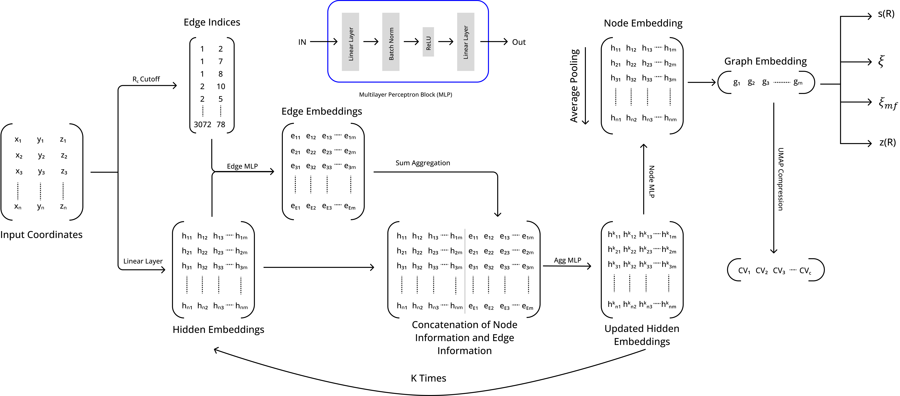

# Mapping Conformational Transitions of a Lipid Bilayer on a Graph Neural Network




This repository contains the code, models, data source links and data processing pipelines for the project **"Mapping Conformational Transitions of a Lipid Bilayer on a Graph Neural Network"**. In this work, we propose a graph-based deep learning framework to predict key collective variables (CVs) describing pore formation and closure in coarse-grained lipid bilayer systems, directly from atomic-scale molecular dynamics simulations.

Further we analyzed Latent space embeddings to understand what model has learn. We also developed a method to create new CVs from Graph embedding.

## ⚙️ Requirements

- torch
- numpy
- pandas
- matplotlib
- tqdm
- scikit-learn
- scipy
- plotly
- MDAnalysis
- umap-learn
- gdown

Install dependencies:

```bash
pip install -r requirements.txt
